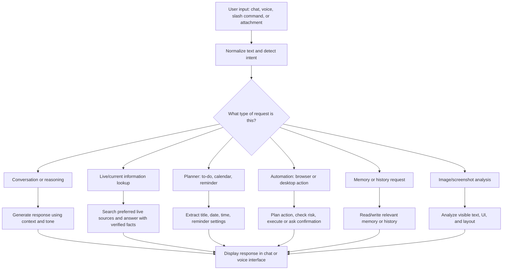
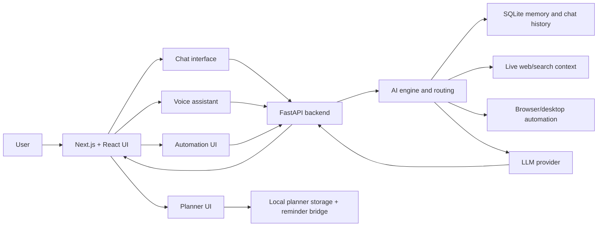

# Akansha

Akansha is an autonomous AI assistant workspace for chat, voice, planning, browser and desktop automation, live information lookup, memory, and task management. It is built as a Next.js frontend with a FastAPI backend, designed to feel like one connected assistant across text, voice, planner, automation, and history views.

Akansha is not only a chatbot. It is intended to understand the user's intent, decide whether a request is a conversation, a live information lookup, a planner action, a browser/desktop automation, a memory update, or a safety-sensitive action, and then route the task through the correct workflow.

## What Akansha Can Do

### Intelligence

Akansha can:

- Understand natural language commands in chat and voice.
- Split compound requests into smaller tasks.
- Ask a follow-up question when required details are missing.
- Use memory and recent conversation context without blindly repeating old answers.
- Detect whether a question needs live web information instead of static model knowledge.
- Recognize when a user is correcting a previous answer and re-check instead of defending the older response.
- Handle multi-question prompts and answer each part separately.
- Adjust tone and language preference for English, Telugu plus English, and Hindi workflows.
- Warn before risky, destructive, private, or irreversible actions.

### Automation

Akansha can prepare and run desktop/browser automation workflows such as:

- Open websites and apps.
- Open links in the browser.
- Open desktop apps where supported.
- Search YouTube and play requested results.
- Scroll pages step by step.
- Close the current tab or window.
- Type into focused fields.
- Fill website forms.
- Edit or clear focused fields.
- Use active-window shortcuts.
- Pause or resume media.
- Increase or decrease system volume.
- Ask before submitting forms or sending sensitive actions.

The browser and operating system still enforce focus, permission, and security rules. Akansha treats automation as best-effort execution with confirmation for sensitive actions.

### Scan Tasks

Akansha supports screenshot and attachment-based reasoning from the chat interface. When an image or screenshot is pasted or uploaded, it can:

- Inspect visible UI elements.
- Read visible text.
- Reason about what is happening on the screen.
- Explain errors and likely causes.
- Suggest what to click or fix next.
- Use screenshots as context for debugging app behavior.

### To-Do Lists and Calendar

Akansha includes a planner workflow for tasks, reminders, and calendar entries.

It can:

- Add to-do items from natural language.
- Add multiple list items.
- Create calendar reminders.
- Extract dates and times from user phrasing.
- Understand phrases like "which is about shopping on Amazon today" and use the important subject as the reminder title.
- Ask for missing event details instead of saving filler setup text.
- Trigger planner reminders through browser and desktop notification paths.
- Display tasks and calendar entries in the planner interface.

Example:

```text
Set an alert at 11:15 PM which is about shopping on Amazon today.
```

Akansha stores the title as:

```text
shopping on Amazon today
```

## How Akansha Thinks

Akansha uses a layered decision flow:



Akansha should not treat every prompt the same way. A live cricket score, a reminder, a website-opening command, a screenshot question, and a coding/debugging request each need different handling.

## How Akansha Understands Tone

Akansha tracks the user's tone and selected voice profile to shape the response style.

Supported tone modes include:

- Friendly
- Professional
- Energetic
- Calm

The assistant can use tone to:

- Keep replies short and direct when the user is task-focused.
- Ask clarifying questions when the request is incomplete.
- Respond more carefully when the user is frustrated.
- Use a more natural conversational style in voice mode.
- Adapt text and speech output to the selected language preference.

## How Akansha Searches Things

For live or recent questions, Akansha should use current sources instead of relying only on model memory.

Examples of live/current topics:

- Cricket scores and current batters.
- News and regional updates.
- Market prices such as gold and silver.
- Weather.
- Stock and financial information.
- Latest model or technology updates.
- Any question containing "today", "yesterday", "latest", "current", "live", or similar wording.

Search behavior:

- Prefer official or authoritative sources when possible.
- Use direct data feeds for structured live information where available.
- Include dates, times, units, and source context when useful.
- Avoid guessing if a live detail cannot be verified.
- Re-check when the user says the answer is wrong.

## How Akansha Displays Information

Akansha displays work through multiple focused interfaces:

- Chat interface for text conversations, attachments, slash commands, pinned messages, and branch-from-message workflows.
- Voice assistant for continuous voice interaction, avatar presence, transcript, and spoken replies.
- Planner service for to-do and calendar workflows.
- Browser automation page for automation prompts and saved automation tasks.
- Conversation history for reviewing and managing older chats.
- Settings for language, appearance, notification, and account preferences.
- API keys page for managing provider credentials.
- Sign-in, sign-up, and forgot-password pages for authentication workflows.

Chat history now shows clearer dates:

- Conversation groups include labels like `Today - 15 May 2026`.
- Conversation rows show date and time.
- Message timestamps show the full date and time on hover.

## Main Pages

| Page | Purpose |
| --- | --- |
| `/chat-interface` | Main chat workspace with slash commands, attachments, pinned messages, conversation branching, and memory indicators. |
| `/voice-assistant` | Voice-first assistant view with continuous listening, transcript, tone controls, and avatar stage. |
| `/planner-service` | To-do list and calendar workspace. |
| `/browser-automation` | Browser and desktop automation center. |
| `/conversation-history` | Search, review, and manage saved conversations. |
| `/settings` | Profile, appearance, language, notification, and security preferences. |
| `/api-keys` | Manage API credentials. |
| `/channel-integrations` | Configure connected communication channels. |
| `/sign-up-login-screen` | Authentication entry page. |
| `/sign-up-login-screen/sign-in` | Sign-in page. |
| `/sign-up-login-screen/sign-up` | Sign-up page. |
| `/sign-up-login-screen/forgot-password` | Forgot-password and OTP recovery flow. |

## Slash Commands

Akansha includes 33 slash commands. Type `/` in the chat composer to open suggestions, then use arrow keys, Tab, or click to select a command.

### Admin

| Command | What it does |
| --- | --- |
| `/help` | Show available slash commands grouped by category. |
| `/summarize` | Summarize text with decisions, risks, and next actions. |
| `/brief` | Create a short executive brief. |
| `/admin-report` | Prepare an administrative status report. Alias: `/report`. |
| `/status` | Turn notes into a progress update. |
| `/policy` | Draft a policy, rule, or governance note. |
| `/sop` | Create a standard operating procedure. |
| `/meeting` | Create a meeting agenda. |
| `/minutes` | Convert notes into meeting minutes. |
| `/decision` | Write a decision memo. |
| `/risk` | Create a risk register. |
| `/audit` | Audit content or a workflow for gaps, risks, and fixes. |

### Planning

| Command | What it does |
| --- | --- |
| `/todo` | Add a to-do item. |
| `/calendar` | Add a calendar item. |
| `/remind` | Create a reminder from natural language. |

### Memory

| Command | What it does |
| --- | --- |
| `/remember` | Save important information to memory. |
| `/forget` | Remove or ignore a memory. |
| `/history` | Search previous chat history. |

### Writing

| Command | What it does |
| --- | --- |
| `/email` | Draft a polished email. |
| `/reply` | Suggest reply options in different tones. |

### Language

| Command | What it does |
| --- | --- |
| `/translate` | Translate text while preserving tone. |
| `/telugu` | Respond in natural Telugu plus English where useful. |
| `/hindi` | Respond in Hindi. |

### Coding

| Command | What it does |
| --- | --- |
| `/debug` | Debug an error with root cause, fix, and verification. |
| `/code-review` | Review code for bugs, regressions, security issues, and missing tests. |
| `/test-plan` | Create a focused test plan. |

### Automation

| Command | What it does |
| --- | --- |
| `/browser` | Run a browser automation task. |
| `/desktop` | Open something as a desktop app. Aliases: `/app`, `/desktop-app`. |
| `/web` | Open something in the browser. |
| `/website` | Open something as a website. Alias: `/site`. |
| `/open` | Open a link, app, or website. |

### Social

| Command | What it does |
| --- | --- |
| `/social` | Review social messages, recommend replies, and wait for approval before sending. |

### Security

| Command | What it does |
| --- | --- |
| `/security` | Review secrets, auth, privacy, access, and data handling risks. |

## Architecture



## Tech Stack

| Layer | Technology |
| --- | --- |
| Frontend | Next.js, React, TypeScript |
| Styling | Tailwind CSS |
| Backend | FastAPI, Python |
| Database | SQLite and SQLAlchemy |
| Voice | Browser Speech Recognition, browser TTS, optional backend TTS |
| Automation | Browser and desktop automation helpers |
| AI | LLM provider integration through backend engine |

## Getting Started

### Install dependencies

```bash
npm install
```

### Run frontend and backend together

```bash
npm run dev
```

Frontend:

```text
http://localhost:4030
```

Backend:

```text
http://localhost:8000
```

### Run frontend only

```bash
npm run dev:frontend
```

### Run backend only

```bash
npm run dev:backend
```

## Environment Variables

Create a `.env` file in the project root.

```env
OPENROUTER_API_KEY=your_openrouter_key

GOOGLE_CLIENT_ID=your_google_client_id
GOOGLE_CLIENT_SECRET=your_google_client_secret
GOOGLE_REDIRECT_URI=http://localhost:8000/api/google/callback

ELEVENLABS_API_KEY=your_elevenlabs_api_key
ELEVENLABS_VOICE_ID=your_voice_id
ELEVENLABS_MODEL_ID=eleven_multilingual_v2
```

## Verification

Recommended checks before shipping:

```bash
npm run type-check
npm run build
python -m unittest backend.test_audit_regressions
```

The regression suite covers important behavior such as live information routing, automation planning, form-submit confirmation, WhatsApp safety checks, YouTube play workflows, auth checks, and speaker access levels.

## Product Notes

- Akansha can make mistakes; important information should be verified.
- Live answers depend on available source access and the quality of current web data.
- Browser and desktop automation are subject to focus, OS, browser, and permission limits.
- Sensitive actions should require confirmation.
- Voice recognition quality depends on browser support, microphone permission, language selection, and background noise.
