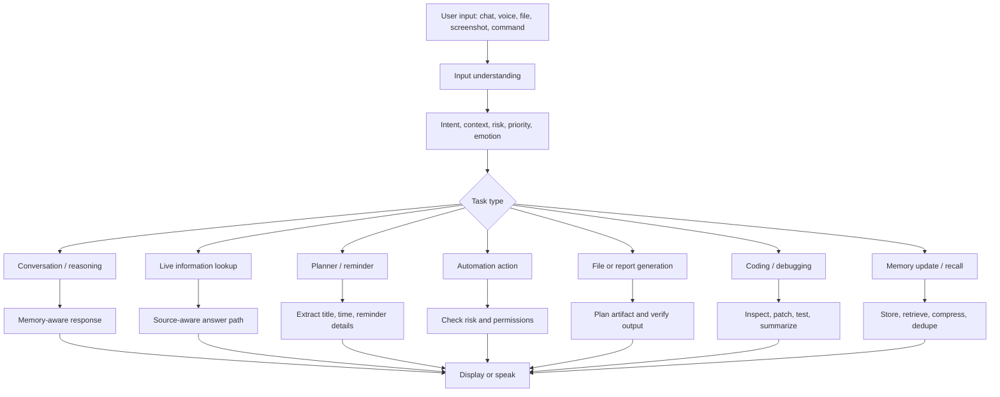
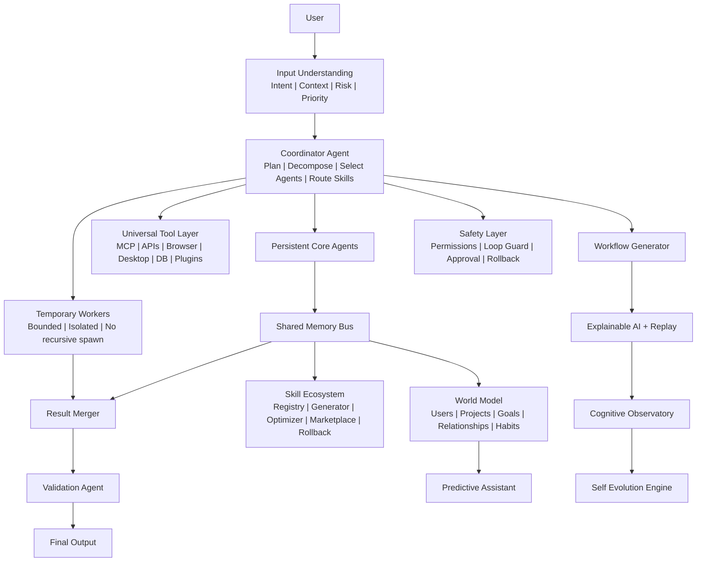
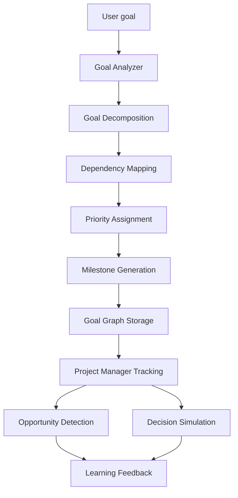
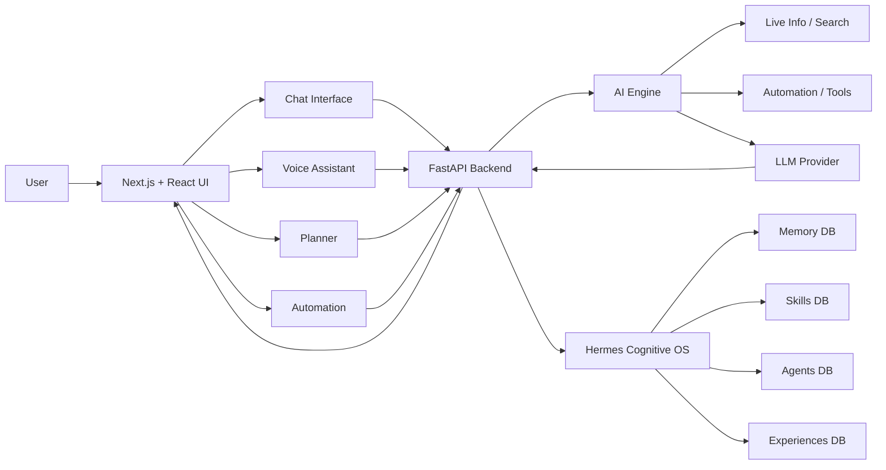

# Akansha

Akansha is a multimodal AI assistant workspace for chat, voice, planning,
automation, memory, live information, file workflows, and cognitive
orchestration. It is built with a Next.js frontend and a FastAPI backend, with
an isolated Hermes cognitive layer for memory, agents, skills, workflow
generation, tool governance, and continuous improvement.

Akansha is not designed as a simple chatbot. It is designed as an AI operating
workspace: it understands intent, chooses the right workflow, uses memory when
useful, checks risk before sensitive actions, routes larger work through agents
and skills, and records lessons so future tasks can improve.

## Current Status

The repository currently includes:

- Chat interface with memory indicators, slash commands, attachments, pinned-message actions, and conversation branching support.
- Voice assistant interface with language, tone, voice profile, transcript, controls, and avatar stage.
- Planner and reminder workflows.
- Browser and desktop automation planning.
- Screenshot/image attachment reasoning surface.
- Authentication screens for sign-in, sign-up, and forgot-password flows.
- Generated-file route for artifacts under `/generated/...`.
- Hermes Cognitive OS backend under `/api/cognitive/*`.
- SQLite-backed memory, skills, experiences, agents, world graph, tools, jobs, and multimodal context stores.
- Autonomous Goal Engine + Digital Executive Brain for long-term goals, milestones, project plans, opportunities, decisions, and personal OS items.
- Autonomous Action Platform for shopping comparisons, booking plans, verification/recheck gates, life automation, personal buying intelligence, digital concierge workflows, and multi-service execution planning.
- Universal Autonomous Cognitive Operating System layer for any task category, uncertainty/human collaboration, self-healing recovery, proactive event detection, universal automation planning, cognitive health scoring, and dashboard updates.
- Cognitive Digital Twin + Future Simulation Engine for habits, preferences, goals, work patterns, decision history, behavior trends, future outcomes, risk predictions, timeline projections, and proactive recommendations.
- Cognitive Observatory Dashboard for active goals, agents, skills, memory usage, execution graph, confidence, health, context load, and learning progress.
- Self Evolution Engine for bounded prompt, memory, workflow, tool, and agent optimization proposals.
- Explainable AI, Time Machine Replay, AI Experiment Lab, Knowledge Graph, Adaptive Work Modes, and Autonomous Testing engines.
- Regression tests for the cognitive layer and audit behaviors.

Some capabilities depend on provider credentials, browser permissions, OS focus,
microphone permissions, or live data availability. Akansha should verify
important information instead of guessing.

## Fast Chat And Deep Work Routing

Akansha now separates everyday conversation from heavier cognitive workflows so
the normal chat and voice experience stays responsive.

| Mode | When it is used | Expected behavior |
| --- | --- | --- |
| Quick | Default mode for greetings, jokes, short corrections, direct time/date, memory updates, safe local actions, and normal conversational turns | Returns immediately from deterministic/local logic whenever possible and avoids provider-heavy analysis |
| Research | Live/news/current questions, citations, source comparison, real-time sports, prices, weather, market data, or fact checking | Uses source-backed lookup and validation, so it can take longer |
| Agent | Multi-step workflows, automation, planning, execution trees, desktop/browser actions, and governed task delegation | Routes through coordinator, tools, permissions, and safety checks |
| Skill | File generation, PDF/PPTX/XLSX/DOCX/CSV/JSON tasks, image/video/audio analysis, coding workflows, and reusable specialist skills | Uses the skill registry and artifact engines, so it may take more time |

The chat interface exposes Quick, Research, Agent, and Skill controls. Quick is
the default for user experience. Research, Agent, and Skill are explicit
slow-lane modes for work that needs deeper reasoning, external providers, live
sources, or generated artifacts.

External provider or authentication failures must not turn simple messages into
a dead end. If the advanced answer lane is unavailable, Akansha keeps quick
chat, time/date, deterministic memory capture, and safe local responses active.
Advanced requests explain that the advanced lane must be restarted or enabled
instead of pretending to analyze unavailable data.

Background memory extraction is also bounded: deterministic memory capture runs
first, and optional provider-based extraction uses a small context window. This
prevents background analysis from slowing down casual chat.

## What Makes Akansha Different

Most AI apps are mainly answer generators: user asks, model replies. Akansha is
different because it is organized around decisions, actions, memory, governance,
and workflows.

| Area | Basic chatbot behavior | Akansha behavior |
| --- | --- | --- |
| Memory | Replays recent chat or forgets context | Stores short-term and long-term memory, deduplicates it, compresses it, and recalls only relevant memories |
| Task handling | Treats every prompt like text | Detects intent: chat, live research, coding, automation, planner, file generation, memory, or safety-sensitive action |
| Tools | Calls a tool directly or not at all | Routes through a governed Universal Tool Layer with approval gates for risky tools |
| Agents | May spawn many uncontrolled agents | Uses persistent core agents plus bounded temporary workers that cannot recursively spawn |
| Learning | Stores success examples only | Records experiences, failures, causes, fixes, rewards, and reflections |
| Anticipation | Waits for a question | Builds a personal cognitive twin, simulates outcomes, predicts risks, and recommends actions before the user gets blocked |
| Skills | Static prompt templates | Versioned skill registry, optimizer, retirement, and marketplace with rollback support |
| Live information | May answer from stale model memory | Detects live/current questions and routes them toward source-backed lookup and validation |
| UI behavior | One fixed interface | Adaptive UI engine can choose coding, research, startup, creative, learning, voice, business, or planning modes |
| Safety | Responds or refuses at the model level | Adds permission checks, loop guards, sensitive-action approval, and risk scoring |
| Observability | Hidden internal decisions | Records explanations, replay events, experiment results, test reports, health, context load, and learning progress |

Akansha is built to become a controllable assistant that can reason, plan,
act, verify, and learn from outcomes without turning into an uncontrolled agent
loop.

## Feature Map

| Capability | Present implementation |
| --- | --- |
| Chat | Main chat workspace, slash commands, history, memory indicators, attachments, generated-file links |
| Voice | Voice assistant page, browser speech/TTS integration, language/tone controls, interrupt controls, avatar stage |
| Planner | To-do, calendar, reminders, natural-language title extraction, notification bridge |
| Automation | Browser/desktop action planning, open/search/scroll/form/media/volume workflows, approval for sensitive actions |
| Image and screenshot reasoning | Paste/upload attachment path in chat and multimodal context storage in Hermes |
| Live information routing | Intent detection for latest/current/live/news/score/price/weather questions |
| Document/file workflows | Generated file route and artifact-generation intent for PDF, PPTX, Excel, DOCX, CSV, JSON style requests |
| Memory | Short-term memory, long-term memory, weighted recall, deduplication, compression |
| Cognitive OS | Agents, skills, workflows, failure learning, world model, predictions, tool governance |
| Goal Engine | Goal graph, dependencies, milestones, project manager, opportunity detection, decision simulation, personal OS |
| Cognitive Digital Twin | Habit/preference/goal/project/work-pattern learning, future simulation, risk heatmaps, decision comparisons, timeline projections, and proactive recommendations |
| Autonomous Action Platform | Commerce comparison, booking planning, verification rechecks, life automation, personal buying intelligence, digital concierge, execution bus, audit metrics |
| Universal Cognitive OS | Universal execution tree, uncertainty questions, self-healing plans, proactive events, universal automation surfaces, cognitive health snapshots |
| Cognitive Observatory | Dashboard snapshots for goals, agents, skills, memory, execution graph, confidence, health, context load, learning |
| Self Evolution | Proposes bounded improvements for prompts, memory recall, workflow order, tools, and agent allocation |
| Explainability | Explains workflow, agent, skill, and tool choices for every planned action |
| Time Machine Replay | Replays task, workflow, failure, learning, experiment, and test history without re-executing tools |
| AI Experiment Lab | Runs A/B prompt, workflow, and agent comparisons with scoring and winner selection |
| Knowledge Graph | Stores users, relationships, projects, dependencies, goals, skills, documents, and tasks |
| Autonomous Testing | Generates test plans, records reports, compares regressions, and feeds health metrics |
| Safety | Permission checks, approval requirements, loop guard, confidence scoring, rollback support |
| Testing | Python unit tests and TypeScript type-check workflow |

## Core Interfaces

| Page | Purpose |
| --- | --- |
| `/chat-interface` | Main chat workspace with slash commands, attachments, generated files, memory, pinned actions, and branching workflows |
| `/voice-assistant` | Voice-first assistant page with transcript, controls, language/tone settings, and avatar stage |
| `/planner-service` | To-do, reminders, and calendar planning |
| `/browser-automation` | Browser and desktop automation center |
| `/cognitive-dashboard` | Cognitive Observatory and Autonomous Action Platform dashboard |
| `/conversation-history` | Search and review saved conversations |
| `/settings` | Profile, appearance, notifications, language, and account settings |
| `/api-keys` | Provider credential management |
| `/channel-integrations` | Connected channel setup |
| `/sign-up-login-screen` | Authentication entry |
| `/sign-up-login-screen/sign-in` | Sign-in flow |
| `/sign-up-login-screen/sign-up` | Sign-up flow |
| `/sign-up-login-screen/forgot-password` | Forgot-password and OTP recovery flow |

## How Akansha Thinks

Akansha follows a layered decision flow instead of using one generic response
path for everything.



The main rule is simple: a cricket score, a PDF request, a browser command, a
voice interruption, and a code bug are not the same kind of task. Akansha routes
them differently.

## Hermes Cognitive OS

Hermes is the backend cognitive operating layer. It is exposed under:

```text
/api/cognitive/*
```

Full architecture notes are in:

[docs/AKANSHA_HERMES_COGNITIVE_OS.md](docs/AKANSHA_HERMES_COGNITIVE_OS.md)

### Hermes Layers



### Persistent Core Agents

Hermes keeps stable core agents for common work:

- ResearchAgent
- CodingAgent
- MemoryAgent
- SecurityAgent
- AutomationAgent
- TestingAgent
- PlanningAgent
- VoiceAgent
- QualityAgent

Temporary workers are created only for complex tasks and are not allowed to
spawn other workers. This keeps coordination, latency, and hallucination risk
under control.

### Dynamic Worker Policy

```text
complexity_score =
steps + tools + dependencies + uncertainty + estimated runtime

complexity < 30  -> 0 temporary workers
complexity < 60  -> 2 temporary workers
complexity < 90  -> 4 temporary workers
complexity >= 90 -> 6 temporary workers
```

Temporary workers:

- use isolated memory
- have temporary lifespan
- cannot spawn workers
- report only to the coordinator
- do not write permanent memory directly

## Autonomous Action Platform

Akansha now has an integrated real-world action layer inside Hermes. It is not a
separate bot and it does not bypass safety. Commerce, booking, verification,
life automation, concierge planning, execution routing, metrics, memory, and
learning all flow through the same coordinator, agents, tools, observatory, and
safety gates.

### Action Platform Engines

| Engine | What it does | Safety behavior |
| --- | --- | --- |
| Autonomous Commerce Engine | Extracts product requirements, compares candidates, ranks products by price/specs/reviews/delivery/history/preferences, and stores buying intelligence | Never purchases without explicit owner approval |
| Autonomous Booking Engine | Plans flights, hotels, restaurants, events, appointments, tickets, and transport with option ranking and schedule validation | Never confirms bookings or payments without approval |
| Verification + Recheck Engine | Rechecks price changes, availability, duplicates, schedule conflicts, payment risk, expired links, and wrong assumptions | Blocks irreversible execution when approval or source data is missing |
| Life Automation Engine | Plans reminders, subscriptions, bills, deadlines, email summaries, follow-ups, and task scheduling | Creates governed plans and requires approval for external side effects |
| Personal Buying Intelligence | Learns budgets, brand preferences, risk tolerance, and buying habits without storing payment secrets | Stores only preference signals and keeps payment data out of memory |
| Digital Concierge | Plans travel, restaurants, meetings, events, gifts, trips, and daily schedules | Verifies availability/conflicts before any booking step |
| Multi-Service Execution Bus | Routes email, calendar, browser, desktop, shopping, maps, payments, documents, task systems, and APIs | Uses least-privilege service scopes, audit logs, rollback strategy, and approval gates |

### Action Platform APIs

```text
POST /api/cognitive/commerce/plan
GET  /api/cognitive/commerce/requests
POST /api/cognitive/booking/plan
GET  /api/cognitive/booking/requests
POST /api/cognitive/verify/action
GET  /api/cognitive/verify/audits
POST /api/cognitive/life-automation/plan
GET  /api/cognitive/life-automation/plans
GET  /api/cognitive/buying-intelligence/profile
POST /api/cognitive/buying-intelligence/preferences
POST /api/cognitive/concierge/plan
GET  /api/cognitive/concierge/plans
POST /api/cognitive/execution-bus/plan
GET  /api/cognitive/execution-bus/events
GET  /api/cognitive/action-platform/metrics
```

The dashboard at `/cognitive-dashboard` displays shopping success rate, booking
accuracy, estimated savings, task completion rate, verification failure rate,
recommendation confidence, execution bus health, system health, context load,
active agents, and learning progress.

## Cognitive Digital Twin + Future Simulation Engine

Akansha now includes an integrated personal intelligence layer that changes it
from "answer after the user asks" into "understand patterns, simulate futures,
predict risk, and recommend the next best action." This is built inside Hermes
and connects to the existing memory engine, goal engine, learning engine,
planner, workflow engine, skill ecosystem, agent system, and dashboard.

### Digital Twin Model

The digital twin stores structured signals about the owner without replaying
entire chats:

- habits
- preferences
- goals
- projects
- learning patterns
- work patterns
- decision history
- execution history
- productivity patterns
- behavior trends

Examples:

- If the user often says testing is delayed, Akansha stores a productivity
  pattern and uses it in future planning.
- If the user repeatedly asks for startup planning, Akansha stores a goal and
  project signal.
- If the user prefers comparison before purchase, Akansha uses that preference
  before recommending products.

### Future Simulation Engine

For goal, buying, scheduling, study, deployment, and general planning prompts,
Akansha generates alternative future paths with:

- success probability
- risk score
- timeline estimate
- resource estimate
- confidence score
- predicted outcomes
- alternative scenarios
- decision rank
- personal fit

Example for a startup goal:

| Scenario | What Akansha evaluates |
| --- | --- |
| Build MVP first | Faster validation, moderate funding risk, strong execution signal |
| Build audience first | Lower build risk, slower revenue, stronger distribution learning |
| Sell services first | Faster cash flow, lower product focus, useful market feedback |

Example for weekly scheduling:

| Scenario | What Akansha evaluates |
| --- | --- |
| Move testing to Tuesday | Reduces Thursday overload risk and matches learned delay pattern |
| Spread work evenly | Lower daily stress but weaker blocker detection |
| Push testing late | Higher failure risk because the twin already learned testing delay behavior |

### Predictive Recommendation Engine

The recommendation layer turns simulations into proactive action:

- proactive actions
- risk alerts
- optimization suggestions
- goal improvements
- approval-aware next steps

It does not automatically perform sensitive actions. Purchases, bookings,
payments, destructive desktop operations, and private-data sharing still require
explicit approval.

### Digital Twin Dashboard

The Cognitive Observatory displays:

- future predictions
- risk heatmaps
- goal forecasts
- decision comparisons
- timeline projections
- behavior trends
- predictive recommendations
- twin confidence

### Digital Twin APIs

```text
POST /api/cognitive/digital-twin/observe
GET  /api/cognitive/digital-twin/profile
GET  /api/cognitive/digital-twin/signals
POST /api/cognitive/future-simulations
GET  /api/cognitive/future-simulations
POST /api/cognitive/predictive-recommendations
GET  /api/cognitive/predictive-recommendations
```

## Universal Autonomous Cognitive Operating System

Akansha now wraps every planned task in a universal operating layer. This layer
does not replace existing memory, planner, workflow, goal, skill, agent,
dashboard, learning, browser automation, desktop automation, voice, safety, or
tool components. It coordinates them so every task has a visible execution tree,
confidence checks, recovery path, automation surface, and health signal.

Supported task domains include:

- Personal
- Productivity
- Research
- Development
- Automation
- Documents
- Communication
- Scheduling
- Education
- Analysis
- Planning
- Travel
- Monitoring
- Media
- Data processing
- Business
- File management
- System management
- API workflows
- Browser workflows
- Desktop workflows

Execution flow:

```text
User goal
-> intent detection
-> task classification
-> task decomposition
-> complexity analysis
-> CoordinatorAgent
-> skill selection
-> agent assignment
-> workflow generation
-> execution plan
-> verification
-> learning update
-> dashboard update
```

### Uncertainty + Human Collaboration Engine

Akansha no longer continues blindly when confidence becomes low. It records a
collaboration question and waits for user input when it detects missing
information, conflicting information, low prediction confidence, tool failure,
uncertain assumptions, authentication issues, unexpected results, blockers, or
workflow dead ends.

Example questions:

- "I need one more detail to avoid guessing. Which option or constraint should I prioritize?"
- "Authentication looks required or expired. Please sign in or confirm which account I should use."
- "This action needs your approval before I continue. Should I proceed with the verified plan?"

### Self-Healing Engine

When a workflow fails or becomes blocked, Akansha records root cause analysis
and creates a recovery plan. Recovery can retry a workflow, select alternate
tools, rebuild the path, switch agents, roll back to a safe state, ask the user,
and continue only after validation.

### Proactive Event Engine

Akansha can detect important signals before the user asks: deadline risk,
deployment environment risk, artifact validation needs, workflow recovery
needs, and approval waiting states. These signals are saved as proactive events
for the dashboard and future learning.

### Universal Automation Layer

Automation is planned through governed surfaces:

- browser actions
- desktop actions
- documents
- files
- emails
- calendars
- API calls
- data processing
- research tasks
- development tasks
- multi-step workflows

Sensitive surfaces require permissions, audit logs, rollback, rate limits, and
verification loops.

### Cognitive Health Engine

The health engine monitors memory usage, agent activity, tool failures,
execution latency, prediction accuracy, workflow efficiency, resource
consumption, hallucination signals, and learning quality. It produces health
snapshots for `/cognitive-dashboard`.

Operating-system APIs:

```text
GET  /api/cognitive/universal-execution/recent
GET  /api/cognitive/collaboration/pending
POST /api/cognitive/collaboration/{question_id}/resolve
GET  /api/cognitive/self-healing/recent
GET  /api/cognitive/proactive-events
GET  /api/cognitive/automation/plans
GET  /api/cognitive/cognitive-health/latest
```

## Autonomous Goal Engine

The latest Hermes layer turns Akansha from request/response behavior into a
goal-driven operating system. A user can now create a long-term objective such
as "Build an AI startup in 6 months" and Hermes stores it as an auditable graph
instead of a loose chat message.

Goal Engine components:

| Component | Purpose |
| --- | --- |
| GoalGraphEngine | Stores goals, dependencies, milestones, task status, progress, health, and risk |
| AutonomousProjectManager | Converts goals into executable task sequences and tracks blockers |
| OpportunityDetectionEngine | Ranks market, project, deadline, failure, and behavior signals |
| DecisionSimulationEngine | Compares choices with success probability, risk, cost, impact, and confidence |
| PersonalOperatingSystem | Stores projects, tasks, ideas, habits, decisions, notes, preferences, and learning history |
| DigitalExecutiveBrain | Coordinates the goal graph, project manager, opportunities, decisions, and personal OS |

## Cognitive Observatory And Evolution

The observability layer makes Hermes inspectable instead of mysterious. Each
planned task can now emit:

- selected workflow and why it was chosen
- selected agents and temporary worker count
- selected skills and tool approval state
- replay event for later task/workflow/failure review
- autonomous test plan
- bounded self-evolution proposals
- dashboard snapshot with health, context load, confidence, and learning progress

API examples:

```text
GET  /api/cognitive/observatory/snapshot
GET  /api/cognitive/observatory/history
POST /api/cognitive/evolution/optimize
GET  /api/cognitive/evolution/events
GET  /api/cognitive/explainability/actions
GET  /api/cognitive/replay
POST /api/cognitive/experiments/run
GET  /api/cognitive/knowledge/graph
POST /api/cognitive/testing/plan
GET  /api/cognitive/testing/reports
```

Goal flow:



API examples:

```text
POST /api/cognitive/goals
GET  /api/cognitive/goals
GET  /api/cognitive/goals/{goal_id}
POST /api/cognitive/goals/{goal_id}/decompose
POST /api/cognitive/goals/{goal_id}/project-plan
GET  /api/cognitive/goals/{goal_id}/progress
POST /api/cognitive/goals/{goal_id}/decisions/simulate
POST /api/cognitive/opportunities/detect
POST /api/cognitive/decisions/simulate
POST /api/cognitive/personal-os/items
POST /api/cognitive/personal-os/classify
```

The Goal Engine uses safety-first defaults:

- no uncontrolled worker spawning
- no duplicate goals
- circular dependency prevention
- progress and health scoring
- blocked task detection
- decision confidence scoring
- coordinator-owned durable memory

## Intelligence Capabilities

Akansha can:

- Understand natural language commands in chat and voice.
- Split multi-step prompts into smaller tasks.
- Detect whether a request needs live information, automation, memory, files, coding, or planning.
- Recognize when the user is correcting a previous answer and re-check instead of defending the old output.
- Ask a follow-up when required details are missing.
- Use short-term and long-term memory without flooding the model with old chat logs.
- Compress older memory into decisions, patterns, and lessons.
- Track failures with task, cause, fix, source, and confidence.
- Choose adaptive UI modes for coding, research, voice, planning, business, and creative workflows.
- Generate workflow plans before execution.
- Use confidence and validation signals before promoting skills.

## Memory Engineering

Akansha uses multiple memory layers:

| Memory type | Purpose |
| --- | --- |
| Short-term memory | Current session context |
| Long-term memory | Durable user preferences, patterns, projects, and facts |
| Vector-like recall | Token embedding similarity with ranking |
| Cognitive compression | Extract decisions, patterns, lessons, and archive noise |
| World model | Graph of users, projects, goals, relationships, habits, deadlines, and preferences |
| Failure lessons | Stores what failed, why, and how to avoid it next time |
| Skill memory | Stores versioned reusable workflows |

Recall formula:

```text
RecallScore =
0.35 * semantic_similarity +
0.20 * importance +
0.15 * recency +
0.15 * usage_frequency +
0.15 * confidence
```

The recall limit is intentionally small. Akansha should use the best 5 to 10
memories instead of dumping every old message back into the model.

## Automation Capabilities

Akansha can plan and run automation workflows such as:

- Open websites.
- Open desktop apps where supported.
- Search YouTube and play requested results.
- Scroll pages step by step.
- Close current tab or window.
- Type into focused fields.
- Fill website forms.
- Edit or clear focused fields.
- Pause or resume media.
- Increase or decrease system volume.
- Ask before submitting forms, sending messages, or doing sensitive actions.

Automation is governed by safety rules:

- Browser and desktop tools can require approval.
- Form submit, payment, delete, password, and send actions are treated as sensitive.
- OS/browser focus and permissions still matter.
- The assistant should report uncertainty instead of pretending an action succeeded.

## Live Information and Search

Akansha detects live/current questions from wording such as:

- latest
- current
- today
- yesterday
- live
- score
- price
- news
- weather

For live information, Akansha should:

- prefer official or authoritative sources
- include timestamps and units where useful
- avoid stale model-memory answers
- avoid confident answers when no source was checked
- re-check when the user says the answer is wrong
- format structured data as tables when helpful

Examples:

| User asks | Expected behavior |
| --- | --- |
| "Give IPL points table" | Return a table with team, matches, wins, losses, NRR, points, and source timestamp |
| "Current silver price per gram in India" | Check a current source, include unit and timestamp |
| "Latest Tamil Nadu news" | Summarize current items with sources |
| "Who is batting now?" | Use live match data, not old model memory |

## Document and File Generation

Akansha is designed to detect file-generation intent and route the work through
artifact workflows.

Supported intent categories:

- PDF reports
- Excel workbooks
- Word documents
- PowerPoint presentations
- CSV files
- JSON files
- Markdown
- Code files
- ZIP-style bundle workflows
- PNG/JPG style image-generation requests through appropriate image tooling

Expected behavior:

- Understand the requested format.
- Build actual content, not just a search link.
- Respect requested page/slide/row counts where possible.
- Include code, tables, charts, explanations, or examples when requested.
- Verify the generated file route exists before returning the link.
- If generation fails, explain the failure and the next repair step.

Example prompts:

```text
Generate a 10-page PDF with the top 30 Java coding questions for TCS placements.
Include complete Java code, comments, explanations, difficulty level, and practice tips.
```

```text
Create an Excel workbook of IPL team stats with columns for team, matches,
wins, losses, NRR, points, and source timestamp.
```

```text
Make a 10-slide PowerPoint on Java basics with examples, diagrams, and a final quiz slide.
```

```text
Create a CSV and JSON file for this student marks dataset and include calculated averages.
```

## Education Module

Akansha can support study workflows such as:

- Explain concepts.
- Solve math or coding problems.
- Generate notes.
- Create flashcards.
- Create quizzes.
- Build formula sheets.
- Generate PDF notes.
- Prepare study plans.
- Convert topics into slides or tables.

## Screenshot and Multimodal Analysis

Akansha supports screenshot and attachment-based reasoning through the chat
interface and Hermes multimodal context graph.

It can:

- Store screenshot/image context for a session.
- Read visible text and UI state when image analysis is available.
- Explain likely errors.
- Suggest next clicks or fixes.
- Combine text, screenshots, PDFs, web pages, and documents into one context graph.

## Voice and Language Behavior

The voice interface includes:

- Browser speech recognition.
- Browser TTS and optional backend TTS paths.
- Language preference controls.
- Voice gender and tone controls.
- Interrupt and mute controls.
- Transcript and avatar stage.

Target language behavior:

- English
- Hindi
- Telugu plus English
- Mixed-language workflows where supported by ASR/TTS providers

Voice quality depends on browser support, microphone permissions, selected
provider, language model, and background noise.

## Tone and Relationship Awareness

Akansha can shape replies using:

- selected tone mode
- language preference
- memory
- relationship profile
- mood indicators
- task seriousness

Tone modes include:

- Friendly
- Professional
- Energetic
- Calm

The design goal is to avoid generic robotic replies and make responses more
context-aware, while still respecting safety and accuracy.

## Slash Commands

Akansha includes 33 slash commands. Type `/` in the chat composer to open
suggestions.

### Admin

| Command | What it does |
| --- | --- |
| `/help` | Show available slash commands grouped by category |
| `/summarize` | Summarize text with decisions, risks, and next actions |
| `/brief` | Create a short executive brief |
| `/admin-report` | Prepare an administrative status report |
| `/status` | Turn notes into a progress update |
| `/policy` | Draft a policy, rule, or governance note |
| `/sop` | Create a standard operating procedure |
| `/meeting` | Create a meeting agenda |
| `/minutes` | Convert notes into meeting minutes |
| `/decision` | Write a decision memo |
| `/risk` | Create a risk register |
| `/audit` | Audit content or a workflow for gaps and fixes |

### Planning

| Command | What it does |
| --- | --- |
| `/todo` | Add a to-do item |
| `/calendar` | Add a calendar item |
| `/remind` | Create a reminder from natural language |

### Memory

| Command | What it does |
| --- | --- |
| `/remember` | Save important information to memory |
| `/forget` | Remove or ignore a memory |
| `/history` | Search previous chat history |

### Writing

| Command | What it does |
| --- | --- |
| `/email` | Draft a polished email |
| `/reply` | Suggest reply options in different tones |

### Language

| Command | What it does |
| --- | --- |
| `/translate` | Translate text while preserving tone |
| `/telugu` | Respond in natural Telugu plus English where useful |
| `/hindi` | Respond in Hindi |

### Coding

| Command | What it does |
| --- | --- |
| `/debug` | Debug an error with root cause, fix, and verification |
| `/code-review` | Review code for bugs, regressions, security issues, and missing tests |
| `/test-plan` | Create a focused test plan |

### Automation

| Command | What it does |
| --- | --- |
| `/browser` | Run a browser automation task |
| `/desktop` | Open something as a desktop app |
| `/app` | Alias for `/desktop` |
| `/desktop-app` | Alias for `/desktop` |
| `/web` | Open something in the browser |
| `/website` | Open something as a website |
| `/site` | Alias for `/website` |
| `/open` | Open a link, app, or website |

### Social and Security

| Command | What it does |
| --- | --- |
| `/social` | Review social messages and suggest replies, with approval before sending |
| `/security` | Check secrets, auth, privacy, access, and data-handling risks |

## Cognitive API Routes

Base prefix:

```text
/api/cognitive
```

| Route | Purpose |
| --- | --- |
| `GET /health` | Cognitive layer health and capability list |
| `POST /memory/short-term` | Store session memory |
| `POST /memory/long-term` | Store durable memory |
| `POST /memory/recall` | Retrieve ranked memories |
| `POST /memory/compress` | Basic memory compression |
| `POST /memory/cognitive-compress` | Extract decisions, patterns, lessons, and archive noise |
| `GET /memory/cognitive-compress/latest` | Read latest compression snapshot |
| `POST /experience` | Record task experience and reward |
| `POST /skills/generate` | Generate skill from repeated successful behavior |
| `POST /skills/promote` | Promote validated skill |
| `POST /skills/optimize` | Improve skill metrics after use |
| `GET /skills/search` | Search skill registry |
| `GET /marketplace` | List marketplace packages |
| `POST /marketplace/install` | Install governed skill package |
| `POST /marketplace/update` | Create new marketplace skill version |
| `POST /marketplace/remove` | Remove installed marketplace package |
| `POST /plan` | Run full cognitive planning flow |
| `POST /analyze` | Analyze task intent, risk, tools, complexity |
| `POST /simulate` | Simulate cognitive routing on multiple tasks |
| `GET /failures` | Read recent failures and lessons |
| `POST /failures/lesson` | Store a failure lesson |
| `GET /tools` | List governed tools |
| `POST /tools/register` | Register tool capability |
| `POST /tools/plan` | Plan tool usage and approval requirements |
| `GET /world` | Read world model graph |
| `POST /world/node` | Add or update world model node |
| `POST /world/edge` | Add or update world model relationship |
| `POST /predict` | Generate proactive suggestions and risk flags |
| `POST /ui/mode` | Select adaptive UI mode |
| `POST /multimodal/ingest` | Store multimodal context item |
| `GET /multimodal/session/{session_id}` | Read session multimodal context |
| `POST /workflows/generate` | Generate workflow chain from user intent |
| `GET /background/jobs` | List bounded background jobs |
| `POST /background/jobs` | Schedule monitor, alert, reminder, update, or task |
| `POST /background/jobs/run-due` | Run due jobs through bounded safe execution |
| `POST /goals` | Create a long-term goal through the Digital Executive Brain |
| `GET /goals` | List goal graph items |
| `POST /opportunities/detect` | Detect proactive opportunities and risks |
| `POST /decisions/simulate` | Compare decisions and predicted outcomes |
| `POST /commerce/plan` | Plan shopping comparison with approval gate |
| `POST /booking/plan` | Plan booking workflow with availability and schedule checks |
| `POST /verify/action` | Run verification and recheck logic before sensitive action |
| `POST /life-automation/plan` | Plan reminders, deadlines, subscriptions, bills, and follow-ups |
| `POST /concierge/plan` | Plan travel, restaurant, meeting, event, gift, or schedule workflows |
| `POST /execution-bus/plan` | Route a governed multi-service execution plan |
| `GET /action-platform/metrics` | Read commerce, booking, verification, and execution metrics |
| `GET /universal-execution/recent` | Read recent universal execution trees |
| `GET /collaboration/pending` | Read tasks paused for user clarification |
| `POST /collaboration/{question_id}/resolve` | Provide missing user input and continue later |
| `GET /self-healing/recent` | Read recovery plans and root-cause analysis |
| `GET /proactive-events` | Read deadline, workflow, approval, and risk signals |
| `GET /automation/plans` | Read browser, desktop, document, API, file, and calendar automation plans |
| `GET /cognitive-health/latest` | Read memory, agent, tool, latency, prediction, hallucination, and learning health |
| `GET /observatory/snapshot` | Read dashboard snapshot |
| `GET /observatory/history` | Read saved dashboard snapshots |
| `GET /metrics` | Cognitive counters and timings |
| `POST /loop/run-once` | Run one bounded maintenance cycle |

## How Akansha Writes and Generates

Akansha should choose the output style based on user intent:

| Intent | Preferred output |
| --- | --- |
| Comparison | Table |
| Sports stats | Table, cards, chart-ready data |
| Study notes | Sections, formulas, examples, quiz |
| Coding request | Code, explanation, test steps |
| Report request | PDF/DOCX-style structured report |
| Spreadsheet request | XLSX/CSV-style rows and formulas |
| Presentation request | PPTX-style slides with titles and bullets |
| Data request | JSON/CSV/table |
| Visual explanation | Diagram or image-generation workflow |

When a user explicitly asks to generate a file, Akansha should generate the
file workflow instead of opening a web search.

## How Akansha Tests and Verifies

Recommended checks:

```bash
npm run type-check
python -m unittest backend.test_hermes_cognitive_os backend.test_audit_regressions
```

Additional checks before release:

```bash
npm run build
```

The backend tests cover:

- memory deduplication and weighted recall
- cognitive compression
- skill generation, promotion, optimization, rollback, and marketplace behavior
- bounded persistent agents and temporary workers
- safety checks for sensitive automation
- workflow generation
- world model and predictive assistant
- multimodal context graph
- background job bounds
- cognitive API import safety
- audit regressions for assistant behavior

## Architecture



## Tech Stack

| Layer | Technology |
| --- | --- |
| Frontend | Next.js 15, React 19, TypeScript |
| Styling | Tailwind CSS, Framer Motion |
| Backend | FastAPI, Python |
| Cognitive storage | SQLite |
| Voice | Browser Speech Recognition, browser TTS, optional backend/provider TTS |
| 3D/avatar | Three.js, React Three Fiber |
| Charts/UI data | Recharts |
| AI providers | OpenRouter/OpenAI-compatible backend integration |

## Getting Started

Install dependencies:

```bash
npm install
```

Run frontend and backend together:

```bash
npm run dev
```

Frontend:

```text
http://localhost:4030
```

Backend:

```text
http://localhost:8000
```

Run frontend only:

```bash
npm run dev:frontend
```

Run backend only:

```bash
npm run dev:backend
```

Run with Docker:

```bash
docker compose up --build
```

The container exposes the frontend on `4030` and backend on `8000`.

## Environment Variables

Create a `.env` file in the project root.

```env
OPENROUTER_API_KEY=your_openrouter_key
OPENROUTER_MODEL=google/gemini-2.0-flash-001

GOOGLE_CLIENT_ID=your_google_client_id
GOOGLE_CLIENT_SECRET=your_google_client_secret
GOOGLE_REDIRECT_URI=http://localhost:8000/api/google/callback

ELEVENLABS_API_KEY=your_elevenlabs_api_key
ELEVENLABS_VOICE_ID=your_voice_id
ELEVENLABS_MODEL_ID=eleven_multilingual_v2
```

Do not commit real API keys.

## Repository Structure

```text
src/
  app/                         Next.js app routes
  components/                  UI, assistant, planner, avatar, automation components
  hooks/                       Voice and app hooks
  lib/                         Slash commands, planner commands, automation helpers
  styles/                      Tailwind and global styles

backend/
  main.py                      FastAPI app
  hermes/                      Cognitive OS
    agents/                    Agent factory, coordinator, workers, merger, validation
    api/                       `/api/cognitive/*` routes
    background/                Bounded background jobs
    database/                  SQLite store and migrations
    evolution/                  Self-evolution proposals
    experiments/                A/B prompt, workflow, and agent comparison
    explainability/             Action explanations
    learning/                  Experience, reward, reflection, failures
    memory/                    Short-term, long-term, recall, compression
    multimodal/                Shared context graph
    goals/                     Goal graph, project manager, decision simulation, personal OS
    knowledge/                  Knowledge graph over users, projects, goals, skills, dependencies
    observatory/                Cognitive dashboard snapshots
    predictive/                Proactive suggestions and risk flags
    reasoning/                 Input understanding, planning, decomposition
    replay/                    Time-machine replay
    safety/                    Permissions and loop guard
    skills/                    Registry, optimizer, marketplace, retirement
    testing/                   Autonomous test plans and regression reports
    tools/                     Universal Tool Layer
    ui/                        Adaptive UI mode selection
    workflows/                 Workflow generation
    world/                     World model graph

docs/
  AKANSHA_HERMES_COGNITIVE_OS.md
```

## Product Notes

- Akansha can make mistakes; verify important information.
- Live answers depend on source availability and provider access.
- Browser and desktop automation depend on focus, permissions, OS rules, and browser state.
- Sensitive actions should require confirmation.
- Voice quality depends on microphone permission, browser speech support, selected language, and background noise.
- The cognitive layer is additive and isolated; it does not replace the existing app UI.
