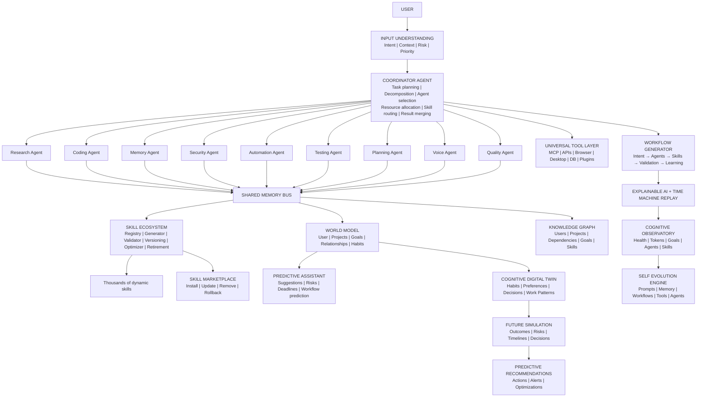
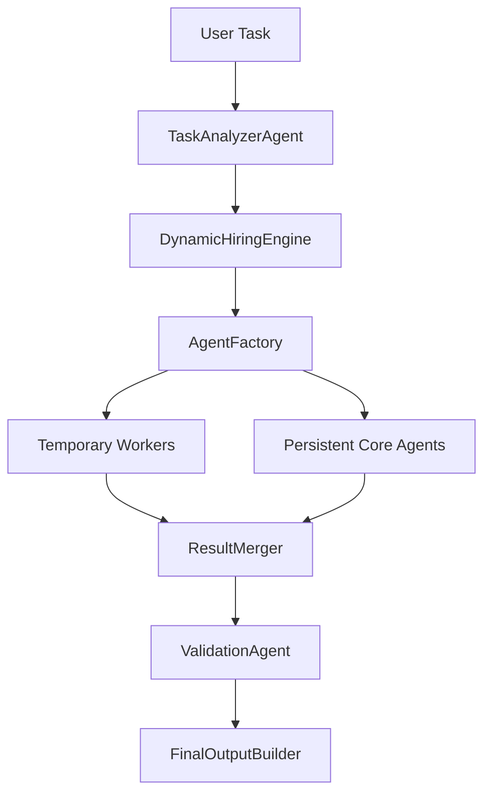

# Akansha / Hermes Cognitive Operating System

Hermes is an isolated cognitive layer for Akansha. It adds durable memory,
experience learning, skill versioning, bounded agent hiring, planning,
reflection, and safety validation without replacing the existing chat or voice
pipeline.

The latest adaptive layer extends Hermes beyond "agent routing" into an AI
operating system: cognitive compression, governed tool access, world modeling,
predictive assistance, adaptive UI modes, multimodal context, workflow
generation, background jobs, a skill marketplace, a Cognitive Digital Twin, and
future simulation.

## Akansha Cognitive Core



### Persistent Core Agents

Hermes keeps nine stable core agents:

- ResearchAgent
- CodingAgent
- MemoryAgent
- SecurityAgent
- AutomationAgent
- TestingAgent
- PlanningAgent
- VoiceAgent
- QualityAgent

These agents use the shared memory bus and provide stable behavior across tasks.
They are deduplicated by name, bounded by the active-agent cap, and controlled by
the coordinator.

### Dynamic Worker System

Temporary workers are created only when task complexity requires parallelism.
They are not persisted to the database.

```text
complexity_score =
steps + tools + dependencies + uncertainty + estimated runtime

if complexity < 30: spawn 0 temporary workers
if complexity < 60: spawn 2 temporary workers
if complexity < 90: spawn 4 temporary workers
if complexity >= 90: spawn 6 temporary workers
```

Temporary workers:

- use isolated temporary memory
- have temporary lifespan
- cannot spawn other workers
- report only to CoordinatorAgent
- are auto-destroyed after completion

This reduces token use because simple work stays with the core agents, while
larger jobs get parallel analysis only when useful.

## Advanced Agent Army Pipeline

Hermes now exposes the complete production routing chain:



Pipeline objects:

- `TaskAnalyzerAgent`: converts text into intent, tools, dependencies, uncertainty, runtime, priority, risk, and complexity.
- `DynamicHiringEngine`: calculates persistent army size and temporary worker count.
- `AgentFactory`: deduplicates persistent core agents and creates non-persistent temporary workers.
- `ResultMerger`: merges worker outputs and detects conflicts.
- `ValidationAgent`: checks safety, confidence, and critical-risk conditions.
- `FinalOutputBuilder`: returns a final execution state: ready, blocked, or needs approval.
- `HermesMetrics`: tracks task allow/block counters and timing summaries.
- `FailureAnalysisEngine`: inspects low-reward experiences and recommends workflow fixes.

## Adaptive OS Extensions

### Cognitive Compression Engine

`CognitiveCompressionEngine` converts raw memory into a compact operating
context:

- extracts decisions
- extracts user patterns
- extracts lessons from failures
- archives low-confidence noise
- persists compression snapshots for audit

It never invents memories. It only compresses stored short-term and long-term
records.

### Universal Tool Layer

`UniversalToolLayer` provides one governance interface for:

- MCP tools
- APIs
- browser automation
- desktop automation
- databases
- plugins

It plans tool usage and approval boundaries. Sensitive desktop/browser actions
are blocked until approved.

### World Model Engine

`WorldModelEngine` stores graph nodes and edges for:

- users
- projects
- goals
- relationships
- behaviors
- deadlines
- preferences

This lets Akansha reason from a stable model of Yogesh, projects, habits, and
constraints instead of replaying entire old chats.

### Predictive Assistant

`PredictiveAssistant` uses task text, analysis, and learned failure lessons to
suggest the next best action. Examples:

- deployment tasks trigger environment-variable risk checks
- live questions trigger source validation
- artifact tasks trigger file verification
- deadlines trigger reminders or study/work plans

### Cognitive Digital Twin

`CognitiveDigitalTwinEngine` is the personal model layer. It does not create a
new assistant or a standalone memory store. It writes into the same Hermes
database and observes the same orchestration flow used by the memory engine,
goal engine, learning engine, planner, workflow engine, skill ecosystem, agent
system, and dashboard.

The twin stores structured owner signals:

- habits
- preferences
- goals
- projects
- learning patterns
- work patterns
- decision history
- execution history
- productivity patterns
- behavior trends

The twin is updated during task processing, continuous learning, and explicit
API calls. It deduplicates similar signals, tracks confidence, increments usage,
and rebuilds a compact profile that can be used for planning without replaying
entire conversations.

### Future Simulation Engine

`FutureSimulationEngine` uses the digital twin profile, the current task,
planner context, prediction context, executive brain context, and workflow
signals to compare possible future paths.

It generates:

- success probability
- risk score
- timeline estimate
- resource estimate
- confidence score
- predicted outcomes
- alternative scenarios
- decision rank
- personal fit score
- risk heatmap
- goal forecast
- decision comparison
- timeline projection
- opportunity prediction

Example simulation domains already implemented:

| Domain | Scenario examples |
| --- | --- |
| Startup and business goals | Build MVP first, build audience first, sell services first |
| Buying decisions | Choose high-performance option, choose lower-price option, wait and verify price |
| Weekly scheduling | Front-load testing, distribute tasks evenly, delay risky tasks |
| Study planning | Practice weak topics first, follow syllabus order, take mock tests first |
| Deployment | Validate tests/env first, deploy with rollback, staged release |
| Generic planning | Fast execution path, quality-first path, low-risk validation path |

### Predictive Recommendation Engine

`PredictiveRecommendationEngine` converts a future simulation into practical
next steps:

- proactive actions
- risk alerts
- optimization suggestions
- goal improvements
- approval-aware execution notes

The engine is intentionally recommendation-first. It can suggest, warn, and
prepare workflows, but sensitive actions still go through Hermes safety gates
and explicit approval rules.

### Digital Twin API Surface

```text
POST /api/cognitive/digital-twin/observe
GET  /api/cognitive/digital-twin/profile
GET  /api/cognitive/digital-twin/signals
POST /api/cognitive/future-simulations
GET  /api/cognitive/future-simulations
POST /api/cognitive/predictive-recommendations
GET  /api/cognitive/predictive-recommendations
```

### Digital Twin Dashboard Panels

The Cognitive Observatory dashboard now exposes:

- Twin Confidence
- Future Simulations
- Decision Rank
- Timeline Pressure
- Digital Twin Profile
- Future Predictions
- Risk Heatmaps
- Goal Forecasts
- Decision Comparisons
- Timeline Projections
- Predictive Recommendations

### Adaptive UI Engine

`AdaptiveUIEngine` chooses a mode configuration without mutating the frontend:

- coding
- research
- startup
- learning
- voice
- planning
- business
- creative

Each mode returns recommended panels, default artifacts, and the response style
the UI can use.

### Cognitive Observatory Dashboard

`CognitiveObservatoryDashboard` turns Hermes internals into a dashboard-ready
snapshot:

- active goals
- active agents
- skills triggered
- memory usage
- task execution graph
- prediction confidence
- system health
- token usage
- learning progress
- recent experiments and autonomous test reports

Snapshots are stored in `observatory_snapshots` so the dashboard can show a
live view and a history view.

### Self Evolution Engine

`SelfEvolutionEngine` continuously proposes bounded improvements for:

- prompt quality
- memory retrieval
- workflow order
- tool selection
- agent allocation

It does not rewrite stable logic automatically. Proposals are stored as
`self_evolution_events` and require validation before promotion.

### Explainable AI Layer

`ExplainableAIEngine` records why Akansha selected a workflow, agents, skills,
and tools. Every task plan can now include:

- reason
- confidence
- workflow selection
- agent selection
- skill selection
- tool selection
- risk level

### Time Machine Replay

`TimeMachineReplayEngine` records replay events for task, failure, workflow,
learning, experiment, and test history. Replay reconstructs what happened
without re-running tools or mutating state.

### AI Experiment Lab

`AIExperimentLab` compares prompts, workflows, and agent strategies. It stores
variant scores, metrics, winner selection, and confidence across accuracy,
latency, safety, cost, and stability.

### Knowledge Graph Engine

`KnowledgeGraphEngine` stores explicit facts and links for relationships,
projects, dependencies, goals, skills, users, documents, and tasks. It mirrors
supported entities into `WorldModelEngine` so the new graph extends existing
memory/world-model behavior instead of creating an isolated subsystem.

### Autonomous Testing Engine

`AutonomousTestingEngine` creates test plans, records reports, compares runs,
detects regressions, and feeds observatory health metrics.

### Autonomous Action Platform

The action platform extends Hermes directly instead of creating a standalone
automation stack. It reuses the existing planner, memory, skill routing,
coordinator agents, tool layer, safety validation, observatory, and learning
flow.

Implemented engines:

- `AutonomousCommerceEngine` extracts shopping requirements, compares candidate
  products, scores price/specs/reviews/delivery/history/preferences, and blocks
  purchase execution behind approval.
- `AutonomousBookingEngine` handles flights, hotels, restaurants, events,
  appointments, tickets, and transport with schedule validation, duplicate
  checks, and approval gates.
- `VerificationRecheckEngine` validates availability, prices, expired links,
  schedule conflicts, payment risk, duplicate bookings, and irreversible action
  risk before execution.
- `LifeAutomationEngine` creates governed plans for reminders, subscriptions,
  bills, deadlines, email summaries, follow-ups, and scheduled tasks.
- `PersonalBuyingIntelligence` stores non-payment buying preferences such as
  budget patterns, favorite brands, quality preferences, and risk tolerance.
- `DigitalConciergeEngine` plans travel, restaurants, meetings, events, gifts,
  trips, and daily schedules with verification.
- `MultiServiceExecutionBus` routes approved workflows through email, calendar,
  browser, desktop automation, shopping, booking, maps, payments, documents,
  task systems, APIs, and databases without bypassing safety.

Safety contract:

- Akansha never purchases, sends payments, confirms bookings, deletes accounts,
  shares private information, or performs irreversible actions without explicit
  user approval.
- Every governed action records a verification audit, confidence score, rollback
  plan, monitoring plan, and execution-bus event.
- Commerce and booking engines refuse to hallucinate products, prices, or
  availability when verified candidates are not available.

### Universal Autonomous Cognitive Operating System

The universal operating layer is the missing execution control plane around the
existing Hermes architecture. It does not create a duplicate agent stack. It
connects directly to the memory engine, planner engine, workflow engine, goal
engine, skill ecosystem, agent system, dashboard, learning engine, browser
automation, desktop automation, voice assistant, safety system, and tool
ecosystem.

Implemented components:

- `UniversalAutonomousExecutionEngine` records a task-level execution tree for
  intent detection, classification, decomposition, complexity analysis,
  CoordinatorAgent, skill selection, agent assignment, workflow generation,
  execution planning, verification, learning update, and dashboard update.
- `UncertaintyCollaborationEngine` detects missing information, conflicting
  information, low prediction confidence, tool failure, uncertain assumptions,
  authentication issues, unexpected results, execution blockers, and workflow
  dead ends. It creates a focused user question instead of continuing blindly.
- `SelfHealingEngine` records root cause analysis and recovery plans for retry,
  alternate tools, path rebuild, agent switching, rollback, validation, and
  continuation.
- `ProactiveEventEngine` observes goals, deadlines, projects, calendar signals,
  system activity, workflow delays, task failures, and patterns. It records
  events such as deadline risk, deployment environment risk, artifact
  validation, workflow recovery, and approval waiting.
- `UniversalAutomationLayer` plans browser actions, desktop actions, documents,
  files, emails, calendars, API calls, data processing, research tasks,
  development tasks, and multi-step workflows through approval and verification
  loops.
- `CognitiveHealthEngine` monitors memory usage, agent activity, tool failures,
  execution latency, prediction accuracy, workflow efficiency, resource
  consumption, hallucination signals, and learning quality.

Universal task domains:

- personal
- productivity
- research
- development
- automation
- documents
- communication
- scheduling
- education
- analysis
- planning
- travel
- monitoring
- media
- data processing
- business
- file management
- system management
- API workflows
- browser workflows
- desktop workflows

### Multimodal Context Graph

`MultimodalContextGraph` stores text, voice, screenshots, images, PDFs, video,
web pages, documents, audio, and spreadsheets in one session graph. Duplicate
items are deduplicated by stable fingerprints.

### Workflow Generation Engine

`WorkflowGenerator` converts intent into an auditable chain:

```text
User goal
→ task analysis
→ tool selection
→ agent selection
→ skill routing
→ validation
→ learning
```

### Background Autonomous Jobs

`BackgroundJobEngine` schedules bounded jobs for monitors, alerts, reminders,
updates, and scheduled tasks. Jobs have max-run caps and never execute in an
unbounded loop.

### Skill Marketplace

`SkillMarketplace` provides governed skill install, update, remove, and rollback
events. Marketplace skills must meet:

- confidence >= 0.85
- reward_score >= 0.80
- non-empty triggers and execution steps

Stable skills are not overwritten; updates create new versions with rollback
links.

## Safety Rules

- Persistent core agents are capped at 10 active agents.
- Temporary workers are capped at 6 per task and are not persisted.
- Duplicate agents are reused instead of spawned again.
- Sensitive tools require approval before execution.
- LoopGuard blocks repeated learning cycles.
- Skills are versioned and never overwritten.
- Stable skills are rollback targets for later versions.
- Memory insertion deduplicates by category and normalized content.
- Recall returns at most 10 memories.

## API Routes

Base prefix: `/api/cognitive`

- `GET /health`
- `POST /memory/short-term`
- `POST /memory/long-term`
- `POST /memory/recall`
- `POST /memory/compress`
- `POST /memory/cognitive-compress`
- `GET /memory/cognitive-compress/latest`
- `POST /experience`
- `POST /skills/generate`
- `POST /skills/promote`
- `POST /skills/optimize`
- `GET /skills/search?q=...`
- `GET /marketplace`
- `POST /marketplace/install`
- `POST /marketplace/update`
- `POST /marketplace/remove`
- `POST /analyze`
- `POST /plan`
- `POST /simulate`
- `GET /failures`
- `POST /failures/lesson`
- `GET /tools`
- `POST /tools/register`
- `POST /tools/plan`
- `GET /world`
- `POST /world/node`
- `POST /world/edge`
- `POST /predict`
- `POST /ui/mode`
- `POST /multimodal/ingest`
- `GET /multimodal/session/{session_id}`
- `POST /workflows/generate`
- `GET /background/jobs`
- `POST /background/jobs`
- `POST /background/jobs/run-due`
- `GET /observatory/snapshot`
- `GET /observatory/history`
- `POST /evolution/optimize`
- `POST /evolution/promote`
- `GET /evolution/events`
- `GET /explainability/actions`
- `POST /replay/record`
- `GET /replay`
- `GET /replay/task`
- `POST /experiments/run`
- `GET /experiments`
- `POST /knowledge/entities`
- `POST /knowledge/links`
- `POST /knowledge/ingest`
- `GET /knowledge/graph`
- `POST /testing/plan`
- `POST /testing/report`
- `POST /testing/compare`
- `GET /testing/reports`
- `POST /commerce/plan`
- `GET /commerce/requests`
- `POST /booking/plan`
- `GET /booking/requests`
- `POST /verify/action`
- `GET /verify/audits`
- `POST /life-automation/plan`
- `GET /life-automation/plans`
- `GET /buying-intelligence/profile`
- `POST /buying-intelligence/preferences`
- `POST /concierge/plan`
- `GET /concierge/plans`
- `POST /execution-bus/plan`
- `GET /execution-bus/events`
- `GET /action-platform/metrics`
- `GET /universal-execution/recent`
- `GET /collaboration/pending`
- `POST /collaboration/{question_id}/resolve`
- `GET /self-healing/recent`
- `GET /proactive-events`
- `GET /automation/plans`
- `GET /cognitive-health/latest`
- `GET /metrics`
- `POST /loop/run-once`

## Databases

Hermes keeps its own SQLite files under `backend/hermes/database/`:

- `memories.db`
- `skills.db`
- `experiences.db`
- `agents.db`

These files are local runtime data and are ignored by Git through the existing
`*.db` rule.

Action-platform storage is initialized inside the same Hermes database layer:

- `commerce_requests`
- `booking_requests`
- `verification_audits`
- `life_automation_plans`
- `buying_intelligence_profiles`
- `concierge_plans`
- `execution_bus_events`
- `action_platform_metrics`
- `universal_executions`
- `collaboration_questions`
- `self_healing_events`
- `proactive_events`
- `automation_plans`
- `cognitive_health_snapshots`

Run migrations manually:

```bash
python -m backend.hermes.database.migrations
```

## Recall Formula

```text
RecallScore =
0.35 * semantic_similarity +
0.20 * importance +
0.15 * recency +
0.15 * usage_frequency +
0.15 * confidence
```

## Skill Promotion

A skill can be promoted only when:

- confidence >= 0.85
- reward_score >= 0.80
- it has passed validation

New versions keep a rollback pointer to the previous stable version.

## Dynamic Hiring

The coordinator calculates complexity from:

```text
task_steps * required_tools * estimated_runtime * uncertainty_score
```

Recommended temporary worker counts:

- complexity < 30: 0 workers
- complexity < 60: 2 workers
- complexity < 90: 4 workers
- complexity >= 90: 6 workers

## Tested Routing Examples

| Task | Intent | Workers | Skill routes | Strategy |
|---|---|---:|---|---|
| Remember Telugu plus English preference | conversation | 0 | MemoryCompressionSkill, WorkflowOptimizerSkill | persistent core only |
| Generate PDF and Excel report with validation | artifact_generation | 4 | PDFGenerationSkill, SpreadsheetAnalysisSkill, PresentationBuilderSkill | parallel worker merge |
| Research latest AI news and export PDF/Excel/PPT | live_research | 6 | DeepResearchSkill, NewsIntelligenceSkill, PDFGenerationSkill, SpreadsheetAnalysisSkill, PresentationBuilderSkill | parallel worker merge |
| Open browser and submit payment form | automation, critical risk | 4 after approval | BrowserAutomationSkill, VoiceCommandSkill | approval-gated workers |
| Debug voice assistant and run tests | coding | 4 | AutonomousDebugSkill, CodeReviewSkill, GitDeploySkill | debug workers plus validation |

## Adaptive OS Test Scenarios

| Scenario | Expected result |
|---|---|
| Store Telugu plus English preference, then compress memory | Compression snapshot contains decisions and user language pattern |
| Plan a desktop-control task without approval | Tool layer blocks desktop tool and marks approval required |
| Record deployment failure caused by missing env vars | Predictive assistant warns to validate env variables next time |
| Ingest duplicate screenshot context | Multimodal graph deduplicates and keeps one session item |
| Generate latest-news PDF workflow | Workflow includes live source validation and file verification |
| Install marketplace skill twice | Second install is rejected as already installed |
| Update marketplace skill | Creates a new version with rollback to previous package |
| Schedule a monitor job | Job is bounded by max_runs and becomes completed after execution |
| Create "Build an AI startup in 6 months" goal | Goal graph stores tasks, milestones, project plan, opportunities, and progress |
| Simulate two MVP decisions | Decision engine ranks choices with success probability, risk, impact, cost, and confidence |
| Plan a PDF workflow | Explainable AI stores selected workflow, agents, skills, tools, risk, and confidence |
| Replay a workflow event | Time Machine returns the stored timeline without re-executing tools |
| Compare two workflow variants | Experiment Lab scores both variants and stores the winner |
| Add user/project knowledge | Knowledge Graph stores facts and mirrors supported nodes into World Model |
| Record passed and failed test reports | Autonomous Testing compares regressions and feeds observatory health |

The design keeps simple tasks cheap and stable, while multi-tool tasks use
temporary workers that cannot recursively spawn or write permanent memory.

## Autonomous Goal Engine

Hermes now includes a Digital Executive Brain that converts long-term objectives
into trackable operating-system state.

```text
User Goal
  -> Goal Analyzer
  -> Goal Decomposition
  -> Dependency Mapping
  -> Priority Assignment
  -> Milestone Generation
  -> Goal Graph Storage
  -> Project Manager Tracking
  -> Opportunity Detection
  -> Decision Simulation
  -> Learning Feedback
```

Stored goal fields include:

- goal_id
- subgoals and executable tasks
- dependencies
- priority
- deadline
- progress
- status
- goal_type
- goal_owner
- goal_context
- estimated_effort
- completion_score
- goal_health
- blocked_reason
- risk_score
- milestones
- execution_state

Safety controls:

- duplicate goal prevention through fingerprints
- circular dependency prevention
- bounded project plans
- blocked task detection
- decision confidence scoring
- no autonomous external action without a separate permission layer
